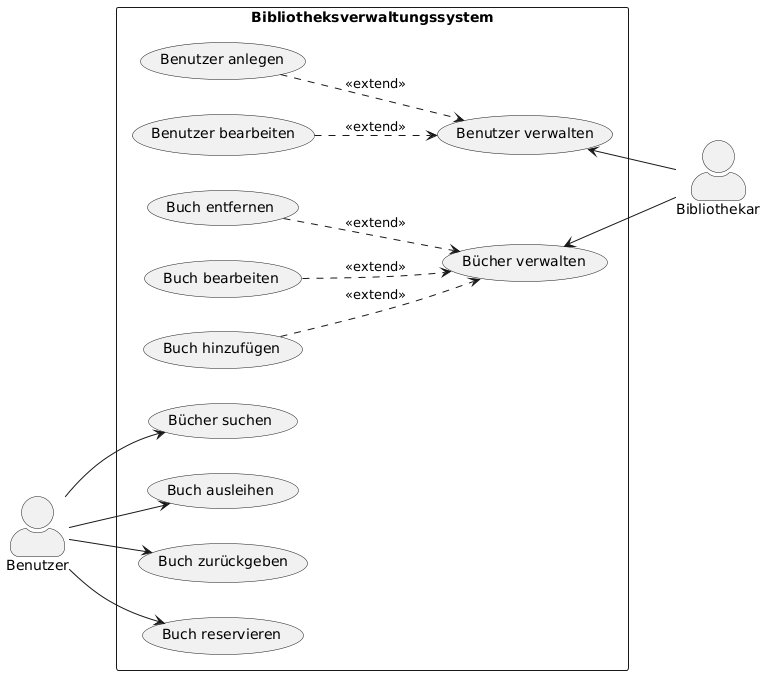
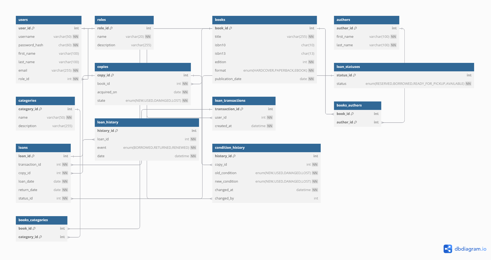
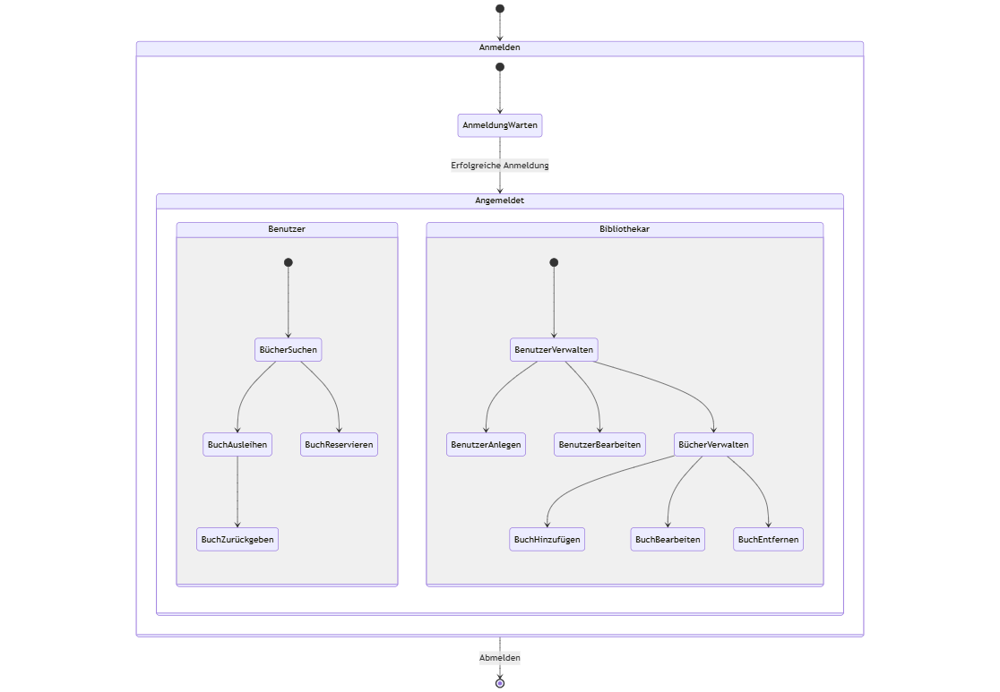

# 📚 LibreLibri - Bibliotheksverwaltung

Willkommen bei LibreLibri! Dieses Projekt ist eine als Teil meiner Ausbildung zum Fachinformatiker für Anwendungsentwicklung entwickelte Webanwendung zur Verwaltung eines Buchbestandes. Das Hauptziel war, ein tiefes Verständnis für Softwarearchitektur, Datenbankdesign und die praktische Anwendung moderner Web-Technologien zu entwickeln.

LibreLibri wurde mit dem **Laravel**-Framework (PHP) für das Backend und **Vue.js** für ein reaktives Frontend umgesetzt.

### **🚀 Features**

-   **Vollständige Buchverwaltung:** Hinzufügen, Bearbeiten und Löschen von Büchern und deren Exemplaren.
    
-   **Strukturierte Katalogisierung:** Zuweisung von Büchern zu Autoren, Kategorien und Formaten.
    
-   **Authentifizierungssystem:** Sichere Benutzerregistrierung und Anmeldung mittels Laravel Breeze.
    
-   **Dynamische Datenansicht:** Anzeige und Verwaltung des Buchbestandes über eine interaktive Benutzeroberfläche.
    
-   **Zustandsverfolgung:** Visuelle Darstellung des Ausleihstatus für jedes Buch.
    

### **📌 Systemarchitektur & Planung**

Ein Kernaspekt dieses Projekts war die sorgfältige und methodische Planung vor der Implementierung. Dies gewährleistet eine stabile und wartbare Codebasis.

#### **1. Use-Case-Diagramm**

Das Diagramm visualisiert die Anwendungsfälle und die Interaktionen der beiden Hauptakteure: `Benutzer` und `Bibliothekar`. Ein normaler `Benutzer` kann Bücher suchen, ausleihen, zurückgeben und reservieren. Ein `Bibliothekar` verfügt über erweiterte Rechte, die ihm die Verwaltung von Büchern (hinzufügen, bearbeiten, entfernen) und Benutzern (anlegen, bearbeiten) ermöglichen.



#### **2. Entity-Relationship-Diagramm (ERD)**

Das ERD illustriert die normalisierte Datenbankstruktur. Es zeigt die Tabellen (Bücher, Autoren, Ausleihen etc.) und deren Beziehungen zueinander, optimiert für Datenintegrität und Abfrageeffizienz.



#### **3. Zustandsdiagramm**

Dieses Diagramm beschreibt den Workflow der Benutzerinteraktion nach der Anmeldung. Abhängig von der zugewiesenen Rolle (`Benutzer` oder `Bibliothekar`) erhält der angemeldete Akteur Zugriff auf unterschiedliche Funktionsgruppen. Der Workflow für den Bibliothek umfasst administrative Aufgaben zur Verwaltung des gesamten Systems.



### **🛠️ Technische Umsetzung**

Die Anwendung folgt einer klassischen **Model-View-Controller (MVC)**-Architektur. Das Laravel-Backend steuert die Geschäftslogik, das Routing und die Datenbankoperationen, während Vue.js für reaktive Frontend-Komponenten sorgt.

-   **Backend:** PHP 8.2 mit Laravel 11
    
-   **Frontend:** Vue.js 3 mit Tailwind CSS
    
-   **Datenbank:** MySQL / MariaDB
    
-   **Entwicklungsumgebung & Tools:** Vite, Node.js/npm, Composer, Git
    

### **💡 Wichtige Lernerfahrungen**

Die größte Herausforderung und der wichtigste Erfolg war die Konzeption der Datenbank. Die Erstellung von Use-Case- und Zustandsdiagrammen sowie eines Entity-Relationship-Diagramms (ERD) im Vorfeld hat mir gezeigt, wie entscheidend eine saubere Planung für den Erfolg eines Softwareprojekts ist. Die Implementierung der Seeder hat zudem mein Verständnis für das Testen und die Datenintegrität maßgeblich vertieft.

### **⚙️ Installation**

1.  **Repository klonen:**
    
    ```
    git clone https://github.com/erik-io/LibreLibri.git
    cd LibreLibri
    ```
    
2.  **Abhängigkeiten installieren:**
    
    ```
    composer install
    npm install
    ```
    
3.  **Umgebungsvariablen konfigurieren:**
    
    ```
    cp .env.example .env
    php artisan key:generate
    ```
    
    _Passe die `DB_*` Variablen in der `.env`-Datei an deine lokale Datenbankkonfiguration an._
    
4.  **Datenbank migrieren und füllen:**
    
    ```
    php artisan migrate --seed
    ```
    
5.  **Server starten:**
    
    ```
    php artisan serve
    npm run dev
    ```
    
    Die Anwendung ist nun unter `http://localhost:8000` erreichbar.
    

### **📝 Lizenz**

Dieses Projekt steht unter der [MIT-Lizenz](https://opensource.org/licenses/MIT). Die Software kann frei verwendet, geändert und weitergegeben werden.
