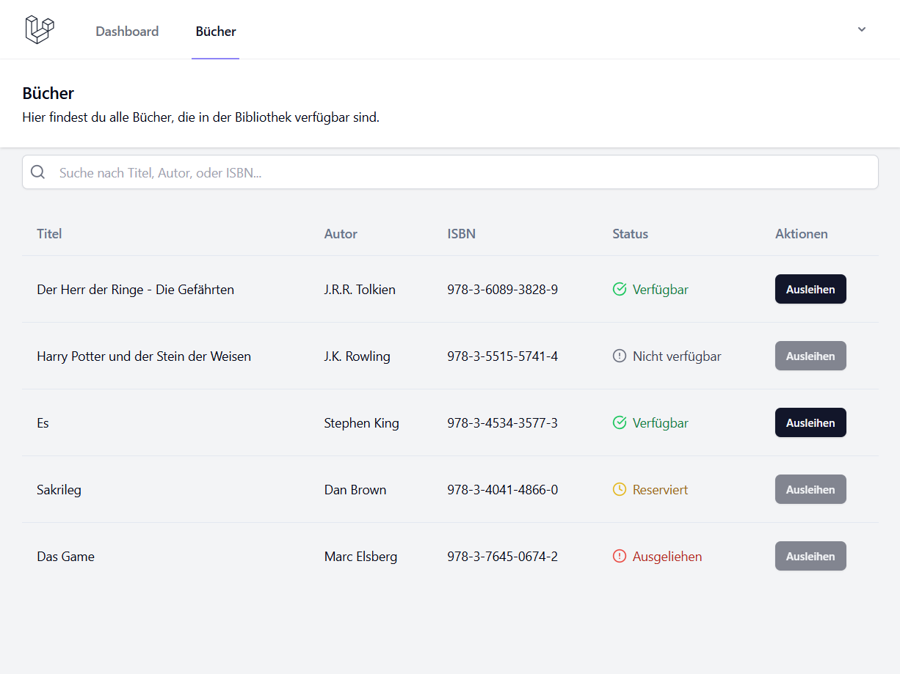

# 📚 LibreLibri

LibreLibri ist eine **Open-Source-Bibliotheksverwaltungssoftware**, die mit **Laravel (PHP)** und **Vue.js** entwickelt wurde. Das Projekt bietet eine moderne Lösung zur Verwaltung von Büchern, Benutzern und Ausleihvorgängen mit einem klar strukturierten Backend und einer interaktiven Benutzeroberfläche.

---

## 🚀 Features

✅ **Buchverwaltung** – Hinzufügen, Bearbeiten und Löschen von Büchern  
✅ **Kategorisierung** – Bücher in verschiedene Kategorien und Genres einteilen  
✅ **Datenbankoptimierung** – Effiziente Speicherung und Abfragen
✅ **Such- und Filterfunktionen** – Für eine schnelle Buchsuche (in Arbeit)
✅ **Ausleih- und Rückgabesystem** – Verwaltung von ausgeliehenen Büchern (in Arbeit)  
✅ **Benutzerrollen & Berechtigungen** – Rollenbasierte Benutzerverwaltung (in Arbeit)
✅ **Erweiterbare API-Schnittstelle** – Für externe Integrationen (in Arbeit)  

---

## 🖥️ Screenshot

Ein Beispielbild der aktuellen Benutzeroberfläche:



---

## 📌 Systemarchitektur

### **1️⃣ Use-Case-Diagramm**
Dieses Diagramm zeigt die wichtigsten Anwendungsfälle und deren Interaktionen.


### **2️⃣ Entity-Relationship-Diagramm (ERD)**
Die Datenbankstruktur von LibreLibri ist so gestaltet, dass sie eine effiziente Verwaltung der Bibliotheksressourcen ermöglicht.


### **3️⃣ Zustandsdiagramm**
Das Zustandsdiagramm zeigt den Workflow mit zwei Hauptbenutzerrollen.


---

## 🛠️ Installation

1. **Repository klonen**
   ```sh
   git clone https://github.com/erik-io/LibreLibri.git
   cd LibreLibri
    ```

2. **Abhängigkeiten installieren**
    ```sh
    composer install
    npm install
    ```

3. **Umgebungsvariablen setzen**
    ```sh
    cp .env.example .env
    php artisan key:generate
    ```

4. **Datenbank migrieren**
    ```sh
    php artisan migrate --seed
    ```

5. **Server starten**
    ```sh
    php artisan serve
    npm run dev
    ```

---

## 📝 Lizenz

Dieses Projekt steht unter der [MIT-Lizenz](https://opensource.org/licenses/MIT). Die Software kann frei verwendet, geändert und weitergegeben werden.
